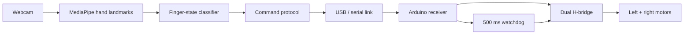

# Gesture Controlled Robot

[](https://github.com/VivekVRobo/gesture-controlled-robot/actions/workflows/python.yml)

A webcam-driven differential-drive robot controller using MediaPipe hand landmarks on the host computer and a small watchdog-protected Arduino receiver on the robot.

> **Status:** software stack complete as a reference implementation; serial port, pin mapping, motor direction, camera placement, and gesture thresholds require validation on the target hardware.

## System overview



## Gesture map

This reference classifier intentionally uses only the four non-thumb fingers so it is less sensitive to left/right hand orientation:

| Extended fingers | Command |
|---:|---|
| 0 | Stop |
| 1 | Turn left |
| 2 | Turn right |
| 3 | Reverse |
| 4 | Forward |

The UI overlays the detected command on the camera feed. Press `q` to quit.

## Quick start

```bash
python -m venv .venv
# Windows: .venv\Scripts\activate
# Linux/macOS: source .venv/bin/activate
pip install -r requirements.txt
```

Run without robot hardware first:

```bash
python vision_control.py --dry-run
```

Then connect a programmed Arduino and run, for example:

```bash
python vision_control.py --port COM5
# Linux example: --port /dev/ttyACM0
```

## Firmware

Upload [`firmware/robot_receiver/robot_receiver.ino`](firmware/robot_receiver/robot_receiver.ino) and verify the pin map in [`docs/HARDWARE.md`](docs/HARDWARE.md). The firmware accepts one-character commands terminated by a newline:

```text
F = forward
B = reverse
L = left
R = right
S = stop
```

If valid commands stop arriving for 500 ms, the receiver stops both motors.

## Repository layout

```text
.
├── src/gesture_robot/
│   ├── app.py
│   ├── gestures.py
│   └── protocol.py
├── firmware/robot_receiver/robot_receiver.ino
├── tests/
├── docs/
├── vision_control.py
├── pyproject.toml
└── requirements.txt
```

## Testing

```bash
pip install -e .
pytest -q
```

The unit tests cover the gesture-to-command mapping and serial protocol encoding without requiring a camera or robot.

## Safety

Start in `--dry-run`. When connecting hardware, lift the wheels first, keep a physical power disconnect accessible, and verify `S` and watchdog behavior before floor testing.

## License

MIT — see [`LICENSE`](LICENSE).
