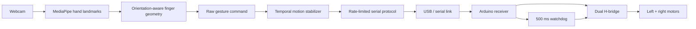

# Gesture Controlled Robot

[](https://github.com/VivekVRobo/gesture-controlled-robot/actions/workflows/python.yml)

A webcam-driven differential-drive robot controller using MediaPipe hand landmarks, orientation-aware non-thumb finger geometry, fail-safe temporal command stabilization, and a watchdog-protected Arduino receiver.

> **Status:** software stack complete as a reference implementation with deterministic geometry/stabilization evidence. Real-camera recognition accuracy, end-to-end latency, serial reliability, motor direction, and robot motion remain hardware/evidence-gated.

## Project snapshot

| | |
|---|---|
| **Perception** | MediaPipe hand landmarks |
| **Gesture classifier** | PIP joint angle + wrist-distance geometry for four non-thumb fingers |
| **Command safety** | Motion commands require consecutive stable frames; STOP and hand-loss STOP are immediate |
| **Transport** | Rate-limited serial command sender |
| **Robot fail-safe** | Arduino receiver stops motors if valid commands disappear for 500 ms |
| **Software evidence** | 120 synthetic landmark rotation cases + command-jitter/hand-loss sequence in CI |
| **Current maturity** | software reference; real camera/serial/robot timing and accuracy remain unmeasured |

## System overview



## Gesture map

The reference classifier uses only the four non-thumb fingers:

| Extended fingers | Command |
|---:|---|
| 0 | Stop |
| 1 | Turn left |
| 2 | Turn right |
| 3 | Reverse |
| 4 | Forward |

Thumb geometry is intentionally excluded to reduce handedness dependence.

## Why the classifier changed

A common beginner implementation labels a finger extended when:

```text
tip.y < PIP.y
```

That assumes the fingers point upward in image coordinates. Rotating the hand can break the decision even when the finger itself stays straight.

This repository instead checks:

```text
MCP → PIP → tip joint geometry
         +
wrist-to-tip distance relative to wrist-to-PIP distance
```

The ideal landmark decision is therefore invariant to simple in-plane rotation. Perspective, occlusion, MediaPipe errors and real camera conditions still require real-data validation.

## Motion stabilization and STOP behavior

A single misclassified frame should not instantly change robot motion.

Default behavior:

```text
new movement gesture
    ↓
frame 1 ─┐
frame 2  │ hold current output
frame 3  │
frame 4 ─┘
    ↓
accept movement command
```

But safety-critical STOP is different:

```text
closed-fist STOP → STOP immediately
hand disappears   → STOP immediately
program exits      → forced STOP command
serial commands stop → firmware watchdog stops motors after 500 ms
```

Temporal smoothing is never allowed to delay a stop.

## Quick start

```bash
python -m venv .venv
# Windows: .venv\Scripts\activate
# Linux/macOS: source .venv/bin/activate
pip install -e .
```

Run without robot hardware first:

```bash
gesture-controlled-robot --dry-run
```

or:

```bash
python vision_control.py --dry-run
```

Control the motion debounce:

```bash
gesture-controlled-robot --dry-run --stable-frames 4
```

Then connect a programmed Arduino and run, for example:

```bash
gesture-controlled-robot --port COM5
# Linux example: --port /dev/ttyACM0
```

## Firmware

Upload [`firmware/robot_receiver/robot_receiver.ino`](firmware/robot_receiver/robot_receiver.ino) and verify the pin map in [`docs/HARDWARE.md`](docs/HARDWARE.md).

The firmware accepts newline-terminated commands:

```text
F = forward
B = reverse
L = left
R = right
S = stop
```

If valid commands stop arriving for 500 ms, the receiver stops both motors.

## Deterministic software evidence

Run:

```bash
python tools/synthetic_gesture_evidence.py
```

Output:

```text
artifacts/synthetic-gesture-evidence.json
```

The current synthetic suite checks:

- 5 extended-finger counts;
- 24 in-plane rotations from 0° to 345° in 15° increments;
- **120 total ideal-landmark geometry cases**;
- single-frame LEFT/REVERSE glitches during a stable FORWARD command;
- a legitimate stable command transition;
- immediate STOP on hand loss.

The report carries explicit boundaries:

```text
evidence_type: synthetic_gesture_geometry_and_stabilization_validation
hardware_evidence: false
real_camera_dataset: false
```

CI regenerates and uploads this evidence on relevant commits.

A 100% synthetic geometry score means the ideal mathematical landmark construction behaves as intended. It does **not** mean 100% MediaPipe/webcam gesture recognition accuracy.

## What real evidence should eventually measure

A representative camera evaluation should capture labeled clips or frames across:

- different hand orientations;
- left and right hands;
- distance from camera;
- lighting levels;
- partial occlusions;
- cluttered backgrounds;
- motion blur;
- transition gestures.

Useful metrics would include gesture confusion, false motion-command rate, stop-detection rate, stabilization latency in frames/ms, camera-to-serial command latency, watchdog behavior and physical command-to-motion latency.

## Repository layout

```text
.
├── src/gesture_robot/
│   ├── app.py
│   ├── gestures.py
│   ├── stabilizer.py
│   └── protocol.py
├── tools/
│   └── synthetic_gesture_evidence.py
├── firmware/robot_receiver/robot_receiver.ino
├── tests/
├── docs/
├── vision_control.py
├── pyproject.toml
└── requirements.txt
```

## Testing

```bash
pip install -e . pytest
pytest -q
```

Tests cover:

- gesture-to-command mapping;
- orientation-aware ideal landmark classification;
- temporal motion stabilization;
- immediate STOP and hand-loss STOP behavior;
- serial protocol encoding.

## Evidence maturity

| Gate | Current |
|---|---|
| Command mapping | ✅ tested |
| Orientation-aware ideal landmark geometry | ✅ tested |
| Temporal motion stabilization | ✅ tested |
| Immediate software STOP on hand loss | ✅ tested |
| Serial encoding/rate limiting | ✅ tested |
| Synthetic geometry/stabilization evidence | ✅ CI-generated |
| Real webcam gesture dataset | ❌ |
| Real confusion/false-command metrics | ❌ |
| End-to-end camera→serial latency | ❌ |
| Firmware watchdog bench evidence | ❌ |
| Physical robot motion evidence | ❌ |

## Safety

Start in `--dry-run`. When connecting hardware, lift the wheels first, keep a physical power disconnect accessible, verify `S`, confirm motor direction, and deliberately test watchdog timeout before floor operation.

Computer vision must not be treated as the sole emergency-stop mechanism for a moving robot.

## Limitations

The classifier intentionally remains lightweight. Joint-angle geometry reduces simple in-plane orientation sensitivity, but it does not solve occlusion, extreme perspective, unreliable landmarks, fast motion, poor lighting or ambiguous hand poses. The four-finger count also encodes only five discrete commands and does not identify which specific fingers are extended.

## License

MIT — see [`LICENSE`](LICENSE).
